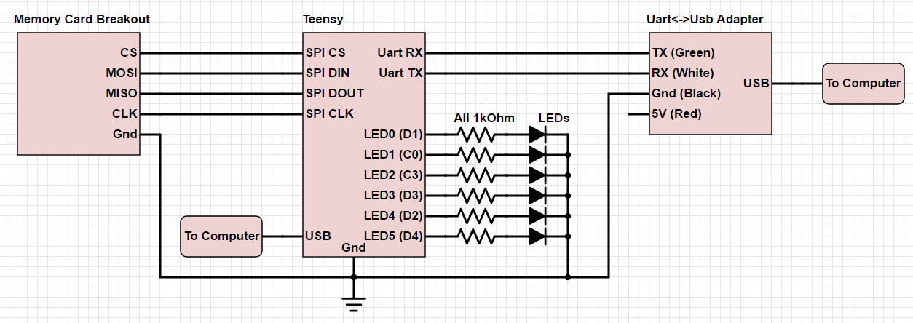
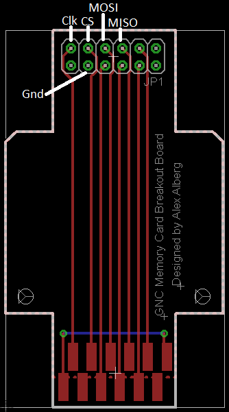

# hem-teensy
Hardware enhanced melee using a teensy 3.x and python 2.7.

## Parts Required

* A teensy 3.1 or 3.2 ($20 from PJRC)
* A Uart<->Usb cable ($10 from Adafruit)
* A memory card breakout board (board files included in this repo)
* A breadboard or another way to prototype a circuit
* Some wires

Other helpful things:
* Headers (to solder to the breakout board)
* A few LEDs
* A few resistors
* The shell of a memory card (circuit board removed)

## Getting Started

### Setting up the Console

There are several methods of setting the console up to run the appropriate assembly code in the game.
The most straightforward method is to use the [gecko code](wii/hem_gecko.txt).
Guides for using gecko codes on a console already exist, so the process will not be documented here.

The second method is to create an .iso file with the assembly already injected into the game. See
[this Smashboards post](http://smashboards.com/threads/the-dol-mod-topic.326347/page-5#post-16623011) for more info.

### Setting up the Circuit

### Setting up the Teensy
A prebuilt binary for the Teensy is located in `firmware/bin/stable`

The firmware can be loaded onto the teensy using `util/teensy.exe`.
Press the button on the teensy to put it in reset mode, open `hem-teensy.hex` with the util program, click program, and click reboot.
The teensy should reboot and start running the firmware.

### Setting up the Python script
The python demo script requires [Python 2.7](https://www.python.org/download/releases/2.7/) and
[pyserial](https://github.com/pyserial/pyserial) to run.

The script should be run after the teensy is connected to the computer, but before a match is started.

## Making Modifications
### Ditching the microUSB cable
Note: I haven't tried this personally, but there isn't any reason why it shouldn't work. Attempt at your own risk.

Once the firmware is loaded and unchanging, the microUSB cable is only used to power the Teensy. The Uart<->Usb cable has a 5V wire that isn't used in the current setup, but the microUSB cable could be disconnected and the 5V from the Uart<->Usb cable could be connected to the Vin pin on the Teensy to power it.

### Rebuilding the Firmware
Quick note: This guide assumes Windows, but most of the steps probably work on a Linux distribution (make would already be installed, and there is a different installer for Teensyduino, but the toolchain should end up in the same place)

Building the code for the Teensy requires the
[Teensyduino](https://www.pjrc.com/teensy/td_download.html) toolchain and
[Make for Windows](http://gnuwin32.sourceforge.net/packages/make.htm)

Once both are installed, edit the Makefile TOOLPATH (line 36) to point to:

`<Arduino install dir>/hardware/tools/arm/bin`

To build the firmware, run `make` from the command line in the `firmware` directory.
`hem-teensy.elf` and `hem-teensy.hex` should appear in `firmware/bin`

## Prior Work

hem-teensy is based on the [Hardware Enhanced Melee](https://github.com/JLaferri/HardwareEnhancedMelee) project by JLaferri.

More info about his project:
[1](http://www.meleeitonme.com/statistics-in-melee-p1/)
[2](http://www.meleeitonme.com/statistics-in-melee-p2/)